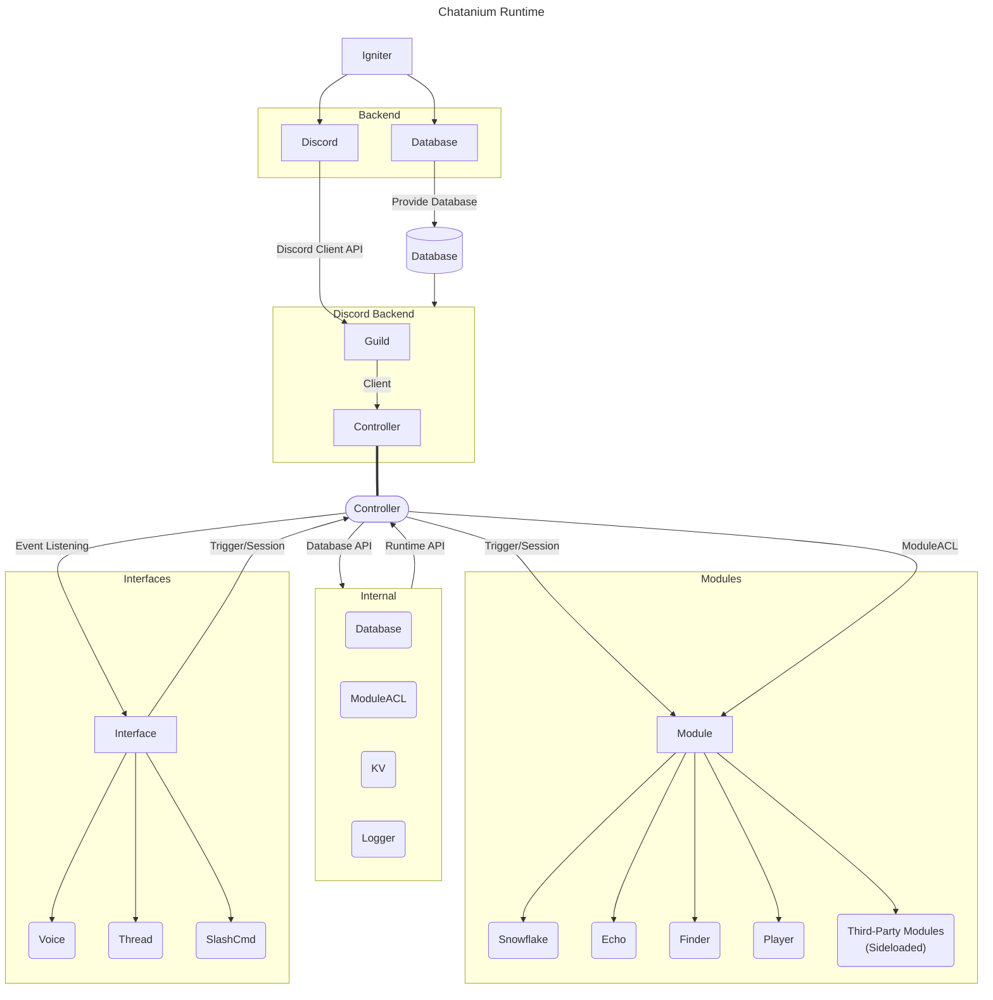

```mermaid
---
title: "Chatanium Runtime"
---
flowchart
	513638["Igniter"] --> 514894["Discord"]
	513638 --> 249225["Database"]
	514894 -->|"Discord Client API"| 339416["Guild"]
	249225 -->|"Provide Database"| 222090[("Database")]
	900030["Controller"] === 995958(["Controller"])
	222090 --> 518963["Discord Backend"]
	995958 -->|"Trigger/Session"| 436581["Module"]
	905398["Internal"] -->|"Runtime API"| 995958
	995958 -->|"Event Listening"| 879546["Interface"]
	995958 -->|"ModuleACL"| 436581
	879546 -->|"Trigger/Session"| 995958
	995958 -->|"Database API"| 905398
	subgraph 518963["Discord Backend"]
		339416 -->|"Client"| 900030
	end
	subgraph 698595["Interfaces"]
		879546 --> 214830("Voice")
		879546 --> 748220("SlashCmd")
		879546 --> 659331("Thread")
	end
	subgraph 905398["Internal"]
		262838("Database")
		745065("Logger")
		411574("KV")
		347153("ModuleACL")
	end
	subgraph 943441["Modules"]
		436581 --> 782415("Echo")
		436581 --> 886218("Finder")
		436581 --> 949372("Player")
		436581 --> 294441("Snowflake")
		436581 --> 954017("Third-Party Modules\n(Sideloaded)")
	end
	subgraph 987126["Backend"]
		249225
		514894
	end
```